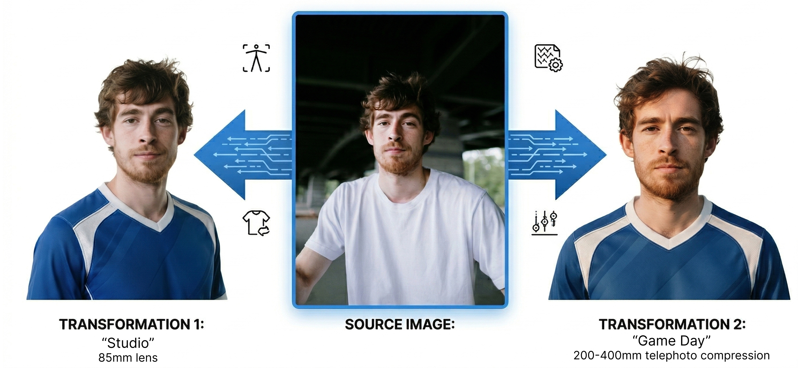
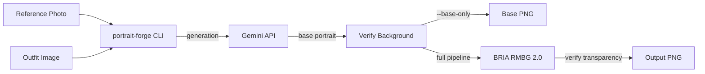

<p align="center">
  <picture>
    <source media="(prefers-color-scheme: dark)" srcset="docs/assets/banner-dark.svg">
    <source media="(prefers-color-scheme: light)" srcset="docs/assets/banner-light.svg">
    
  </picture>
</p>

<p align="center">
  <strong>A Claude Code plugin that turns reference photos into transparent portraits in any style, with visual QA.</strong>
</p>

<p align="center">
  <a href="#claude-code-plugin"></a>
  <a href="https://github.com/derrickko/portrait-forge/actions/workflows/test.yml"></a>
  <a href="https://github.com/derrickko/portrait-forge/blob/main/LICENSE"></a>
</p>

<p align="center">
  
</p>

## Install

```
/plugin marketplace add derrickko/portrait-forge
/plugin install portrait-forge
```

Also available as a standalone CLI (see [CLI Reference](#cli-reference))

## Quick Start

```
You: Generate a portrait from refs/jane.png with the blazer outfit
Claude: Running portrait-forge...
        Portrait saved to outputs/jane.png (1024x1024, transparent)
```

```
You: Generate portraits for everyone in subjects.csv
Claude: Submitting batch... 42 subjects queued.
        Polling every 5 minutes with /loop.
        Batch complete. Processing results.
        40 succeeded, 1 failed, 1 skipped.
```

The `/portrait-forge` skill handles single-image and batch runs conversationally. For batches, it uses `/loop` for automatic status polling.

> **Requires:** [Gemini API key](https://aistudio.google.com/apikey) and [Replicate API token](https://replicate.com/) set as environment variables. [Claude Code](https://docs.anthropic.com/en/docs/claude-code) for the plugin and visual QA.

---

## How It Works

portrait-forge wraps [Gemini](https://ai.google.dev/) image generation and [BRIA RMBG 2.0](https://bria.ai/) background removal (via [Replicate](https://replicate.com/)) into a single pipeline. Batch orchestration, resumable state, structured JSON output. Works for game rosters, team pages, or avatar systems.

Two stages per portrait:

1. **Generate:** Gemini creates a stylized portrait from your reference photo and outfit image, rendered on a solid background.
2. **Remove background:** BRIA RMBG 2.0 strips the background, producing a transparent PNG with edge-quality verification.

When used as a Claude Code plugin, the `/portrait-forge` skill adds optional visual QA via Claude between stages, rejecting portraits that fail style, identity, or edge-quality checks.

In batch mode, step 1 uses the Gemini Batch API for bulk generation. All state is stored locally, resumable from any interruption.

## Features

| Feature | Details |
|---------|---------|
| Single-image mode | One command from reference photo to transparent portrait |
| Batch mode | Submit a CSV, poll progress, process results; all state is local, resumable, and idempotent |
| Visual QA via Claude | Optional two-stage review (Stage 1 + Final) orchestrated by the `/portrait-forge` skill |
| Multi-resolution output | Generate 1024, 512, 256, and other UI-ready PNGs in one pass |
| Structured JSON output | `--json` emits streaming NDJSON events for automation and CI |
| Manifest export | Write a machine-readable `manifest.json` for downstream build steps |
| Custom styles | 2 built-in styles + `/create-style` skill for scaffolding your own |

## Styles

| Style | Description |
|-------|-------------|
| `game-day` | Photojournalistic sports portrait (default) |
| `studio` | Photorealistic corporate portrait |

Create custom styles with the `/create-style` skill, or manually by adding a `style.md` and optional `qa.md` to `./styles/<name>/`. User-local styles override built-in styles with the same name.

`style.md` supports `${SUBJECT_TYPE}`, `${OUTFIT_DESCRIPTOR}`, and `${OUTFIT_PATH}` variables.

<details>
<summary>Style lookup and manual creation</summary>

When you pass `--style <name>`, portrait-forge searches two locations:

1. **`./styles/<name>/`** in your working directory (user-local)
2. **Built-in `styles/<name>/`** in the package

You can also pass an explicit path: `--style ./my-styles/anime`

Use `--list-styles` to see all available styles and their source:

```bash
portrait-forge --list-styles
# game-day
# studio
```

A style directory contains two files:

```
styles/anime/
  style.md           # required: complete generation prompt
  qa.md              # optional: QA criteria (falls back to shared default)
```

Copy an existing style directory and edit `style.md` and `qa.md`. Use `src/prompts/generation.md` and `src/prompts/qa-stage1.md` as structural references.

When using batch mode, the style is saved in batch state at submit time and automatically restored at process time.

</details>

## Visual QA

When using the `/portrait-forge` skill, each portrait can go through two visual review stages powered by [Claude](https://docs.anthropic.com/en/docs/claude-code):

**Stage 1 QA** checks style consistency, identity preservation, outfit integration, and framing on the base render.

**Final QA** checks for quality loss, edge artifacts, haloing, and incomplete background removal on the transparent output.

| Verdict | Meaning |
|---------|---------|
| `APPROVED` | All checks pass |
| `APPROVED_WITH_WARNINGS` | Minor issues, usable as-is |
| `NEEDS_REVISION` | Critical issue; portrait is rejected |

The skill automatically retries rejected portraits by rerunning the full pipeline from Gemini.

## Claude Code Plugin

The plugin provides three components:

| Component | Description |
|-----------|-------------|
| `/portrait-forge` skill | Orchestrates submit, poll, and process from natural language |
| `/create-style` skill | Scaffolds new style directories with generation and QA prompts |
| Stage 1 + Final QA agents | Visual review of base renders and transparent outputs |

> **Requires** the `portrait-forge` CLI available on your PATH (see [CLI Reference](#cli-reference)), API keys set, and [Claude Code](https://docs.anthropic.com/en/docs/claude-code) for visual QA.

To customize settings when running as a plugin, place a `portrait-forge.config.json` in your project directory. The skill resolves config relative to your working directory. See [Configuration](#configuration) for the full schema.

<details>
<summary>CLI Reference</summary>

### Prerequisites

- **Node.js 20+** ([download](https://nodejs.org/))
- **Gemini API key** ([get one](https://aistudio.google.com/apikey))
- **Replicate API token** ([sign up](https://replicate.com/))

### Install (CLI)

```bash
git clone https://github.com/derrickko/portrait-forge.git
cd portrait-forge
npm install
npm link
```

### Quick Start (CLI)

```bash
# 1. Set your API keys
export GEMINI_API_KEY="your-key"
export REPLICATE_API_TOKEN="your-token"

# 2. Generate a portrait
portrait-forge \
  --ref photo.png \
  --outfit blazer.png \
  --output portrait.png

# 3. (Optional) Multi-resolution output
portrait-forge \
  --ref photo.png \
  --outfit blazer.png \
  --output portrait.png \
  --sizes 512,256
```

Output is a **1024 &times; 1024 transparent PNG**, with optional 512px and 256px variants.

> **Tip:** Explore without API keys using inspect commands:
> ```bash
> portrait-forge --list-styles    # see available styles
> portrait-forge --show-config    # see resolved configuration
> ```

### Single Image

```bash
portrait-forge \
  --ref ./refs/jane.png \
  --outfit ./outfits/blazer.png \
  --subject-type "corporate professional" \
  --output ./outputs/jane.png
```

| Flag | Description | Default |
|------|-------------|---------|
| `--ref <path>` | Reference photo (face & pose source) | *required* |
| `--outfit <path>` | Outfit overlay image | *required* |
| `--subject-type <value>` | Prompt descriptor for the subject | `"person"` |
| `--output <path>` | Output file path | `./outputs/<id>.png` |
| `--style <name-or-path>` | Style profile for generation | `game-day` |
| `--base-only` | Stop after generation (skip background removal) | off |
| `--sizes <list>` | Additional PNG sizes to derive from the 1024 output | off |
| `--manifest` | Write `manifest.json` beside the output | off |
| `--json` | Emit NDJSON progress to stdout | off |
| `--verbose` | Extra logging | off |

When `--json` is enabled in single-image mode, the command emits a `complete` event followed by a final `summary` line.

> **Tip:** Use `--base-only` to stop after generation and verification, skipping background removal. This is useful when the `/portrait-forge` skill orchestrates QA between stages.

### Batch Workflow

Batch mode uses the [Gemini Batch API](https://ai.google.dev/) for bulk generation with resumable local state. Three stages:

#### 1. Submit

```bash
portrait-forge --csv ./subjects.csv --json
# → { "batchName": "batch-1711234567", "subjectCount": 42, "skipped": 1 }
```

Add `--dry-run` to validate the CSV without submitting.

#### 2. Poll

```bash
portrait-forge --status batch-1711234567 --json
# → { "batchState": "RUNNING", "progress": "12/42" }
```

#### 3. Process

Once the batch reaches `SUCCEEDED`:

```bash
portrait-forge --process batch-1711234567 --json
# → { "type": "complete", "subjectId": "jane-doe", ... }
# → { "type": "summary", "processed": 41, "succeeded": 40, "failed": 1 }
```

| Flag | Description | Default |
|------|-------------|---------|
| `--csv <path>` | CSV file with subjects | none |
| `--default-outfit <path>` | Fallback outfit when CSV column is empty | none |
| `--output-dir <path>` | Directory for output PNGs | `./outputs` |
| `--concurrency <n>` | Parallel workers for BG removal & QA | `2` |
| `--sizes <list>` | Additional PNG sizes written during `--process` | off |
| `--manifest` | Write `<output-dir>/manifest.json` after processing | off |
| `--style <name-or-path>` | Style profile for generation | `game-day` |
| `--base-only` | Stop after generation during `--process` (skip background removal) | off |
| `--json` | Emit NDJSON progress to stdout | off |
| `--verbose` | Extra logging | off |
| `--dry-run` | Validate CSV only, no API calls | off |

Batch state is stored in `./batches/<batch-name>.json`. Run `--status` and `--process` from the same directory where you ran `--csv`.

`--json` on `--process` emits NDJSON. Each subject produces either a `complete` or `failed` event, and the last line is always a `summary`.

### Utility Commands

```bash
portrait-forge --list-styles           # Show available style profiles
portrait-forge --list-batches          # List batch runs in ./batches/
portrait-forge --show-config           # Print resolved configuration
portrait-forge --validate-style anime  # Check a style for missing files or variables
```

All four accept `--json` for machine-readable output.

### CSV Format

```csv
name,ref_path,outfit_path,subject_type
Jane Doe,refs/jane.png,outfits/blazer.png,corporate professional
John Smith,refs/john.png,outfits/hoodie.png,character portrait
```

| Column | Required | Notes |
|--------|----------|-------|
| `name` | yes | Display name for the subject |
| `id` | no | Custom identifier; derived from `name` if omitted |
| `ref_path` | no | Falls back to `--ref` CLI flag |
| `outfit_path` | no | Falls back to `--default-outfit` CLI flag |
| `subject_type` | no | Falls back to `--subject-type` CLI flag or `"person"` |

Resolution order: **CSV column > CLI flag > built-in default**.

</details>

<details>
<summary>Configuration</summary>

### API Keys

Set these as environment variables or in a `.env` file in your working directory:

```bash
export GEMINI_API_KEY="your-key"
export REPLICATE_API_TOKEN="your-token"
```

When working from a cloned repo, you can copy the included example instead:

```bash
cp .env.example .env
```

### Config File

All non-secret settings live in `portrait-forge.config.json`. Copy the example to get started:

```bash
cp portrait-forge.config.example.json portrait-forge.config.json
```

Or pass a custom path:

```bash
portrait-forge --config ./my-config.json --ref photo.png --outfit blazer.png
```

```json
{
  "models": {
    "forge": "gemini-3.1-flash-image-preview",
    "backgroundRemoval": "bria/remove-background",
    "backgroundRemovalVersion": null
  },
  "verification": {
    "expectedDimension": 1024,
    "baseThreshold": 0.8,
    "transparencyThreshold": 0.04,
    "passRatio": 0.5,
    "verificationMargin": 10,
    "sampleSize": 5
  },
  "replicate": {
    "maxRetries": 3,
    "backoffMs": 2000
  }
}
```

All keys are optional. Missing keys fall back to environment variables, then built-in defaults.

**Resolution order:** CLI flag &rarr; config file &rarr; environment variable &rarr; built-in default.

### Full Config Reference

| Section | Key | Description | Default |
|---------|-----|-------------|---------|
| `models` | `forge` | Gemini model for generation | `gemini-3.1-flash-image-preview` |
| `models` | `backgroundRemoval` | Background removal model (Replicate model ID) | `bria/remove-background` |
| `models` | `backgroundRemovalVersion` | Pin a specific model version | latest |
| `verification` | `expectedDimension` | Expected image width/height in pixels | `1024` |
| `verification` | `baseThreshold` | Minimum RGB ratio for base background verification (0-1) | `0.8` |
| `verification` | `transparencyThreshold` | Maximum alpha ratio for transparency (0-1) | `0.04` |
| `verification` | `passRatio` | Fraction of corner samples that must pass (0-1) | `0.5` |
| `verification` | `verificationMargin` | Pixel margin from edges for sampling | `10` |
| `verification` | `sampleSize` | Pixel width of each corner sample | `5` |
| `replicate` | `maxRetries` | Max retry attempts for Replicate API | `3` |
| `replicate` | `backoffMs` | Base delay for exponential backoff (ms) | `2000` |

Environment variables (`PORTRAIT_FORGE_MODEL`, `PORTRAIT_BASE_THRESHOLD`, etc.) still work as a fallback for backward compatibility.

</details>

<details>
<summary>Programmatic API</summary>

portrait-forge exports its core modules for use in Node.js scripts:

```js
import { processImmediate, generateBaseImage, removeBackground } from './src/pipeline.mjs';
import { submit, status, process } from './src/batch.mjs';
import { resolveStyle, listStyles } from './src/style.mjs';
import { loadConfig } from './src/config.mjs';
```

All API clients are injectable. Pass your own Gemini or Replicate client to any function for custom integrations or testing.

| Module | Key exports |
|--------|-------------|
| `src/pipeline.mjs` | `processImmediate`, `generateBaseImage`, `removeBackground`, `verifyBaseBackground`, `verifyTransparency`, `writeManifest` |
| `src/batch.mjs` | `submit`, `status`, `process`, `listBatches`, `readCsvSubjects` |
| `src/style.mjs` | `resolveStyle`, `listStyles`, `validateStyle` |
| `src/config.mjs` | `loadConfig` |
| `src/utils.mjs` | `sanitizeSubjectId`, `sanitizeSubjectName`, `validatePathInput`, `writeJsonAtomic` |

</details>

## Architecture



When used via the `/portrait-forge` skill, Claude performs visual QA between stages (after generation and after background removal), with auto-retry on rejection.

**Key design decisions:**

- **Local-first state:** batch progress lives in `./batches/*.json`, not in the cloud. Resume from any interruption.
- **Atomic writes:** state files write to `.tmp` then rename, preventing corruption on crash.
- **Fully testable without real API calls:** all API clients and runners are injected.
- **Path security:** all user-provided paths are validated against traversal, null bytes, and URL schemes.
- **Sensitive data scrubbing:** API keys and tokens are redacted from error messages.

## Development

```bash
git clone https://github.com/derrickko/portrait-forge.git
cd portrait-forge
npm install
npm test
```

Tests use Node's built-in test runner with fully mocked API clients. No API keys needed.

<details>
<summary>Project structure</summary>

```
portrait-forge/
  bin/               CLI entry point
  src/               Core modules (pipeline, batch, config, style, utils)
  src/prompts/       Shared prompt templates and QA schema
  test/              Tests (mirrors src/)
  styles/            Built-in style profiles (style.md + qa.md per style)
  skills/            Claude Code skill definitions
  samples/           Example inputs and CSV
  .claude-plugin/    Plugin marketplace metadata
```

</details>

<details>
<summary>Test files</summary>

```
test/
├── cli.test.mjs              # Flag parsing, mode validation, key checks
├── batch.test.mjs             # CSV parsing, state persistence, end-to-end batch
├── pipeline.test.mjs          # Image generation, BG removal, QA orchestration
├── replicate-client.test.mjs  # Retry logic, version pinning, error handling
├── style.test.mjs             # Style resolution and loading
├── config.test.mjs            # Config file loading and merge
├── utils.test.mjs             # Sanitization, path security, token scrubbing
├── qa-prompt-drift.test.mjs   # Agent ↔ CLI prompt consistency
└── helpers.mjs                # Shared test utilities
```

</details>

### Running with local changes

```bash
node bin/portrait-forge.mjs --ref photo.png --outfit blazer.png --json
```

### Contributing

Contributions are welcome. See [CONTRIBUTING.md](CONTRIBUTING.md) for development setup, testing conventions, and PR guidelines.

- [Report a bug](https://github.com/derrickko/portrait-forge/issues/new?labels=bug)
- [Request a feature](https://github.com/derrickko/portrait-forge/issues/new?labels=enhancement)
- [Open a pull request](https://github.com/derrickko/portrait-forge/pulls)

## Troubleshooting

### Missing API keys

**Issue:** CLI exits with "missing GEMINI_API_KEY" or "missing REPLICATE_API_TOKEN".

**Fix:** Export both variables, or create a `.env` file from the included example:
```bash
cp .env.example .env   # then fill in your keys
```

### Batch state not found

**Issue:** `--status` or `--process` can't find the batch JSON.

**Fix:** Run from the same directory where `--csv` was invoked. Batch state is stored in `./batches/`.

### `sharp` install fails

**Issue:** Native module build errors during `npm install`.

**Fix:** Ensure you're on Node 20+ and reinstall dependencies on the target platform.

### Batch shows `FAILED`

**Issue:** Gemini Batch API reports `FAILED` status.

**Fix:** Check Gemini API quotas and input image validity. Resubmit with `--csv`.

### QA rejects every portrait

**Issue:** Every portrait gets a `NEEDS_REVISION` verdict from the `/portrait-forge` skill's visual QA.

**Fix:** Try a different `--subject-type` or adjust the style profile. Run with `--verbose` to see full verdict details.

### Halo or fringe on transparent output

**Issue:** Visible edge artifacts after background removal.

**Fix:** The default model is BRIA RMBG 2.0. Try a different `backgroundRemoval` model in config, or resubmit with a fresh generation.

## Security

If you discover a security vulnerability, please report it privately via [GitHub Security Advisories](https://github.com/derrickko/portrait-forge/security/advisories) rather than opening a public issue.

portrait-forge handles API keys for Gemini and Replicate. Keys are loaded from environment variables or `.env` files and are **never** logged, stored in batch state, or transmitted beyond their respective API endpoints. All error output is scrubbed of tokens and keys before display.

See [Architecture](#architecture) for details on path security, atomic writes, and input validation.

## Changelog

See [CHANGELOG.md](CHANGELOG.md) for a list of changes in each release.

## Acknowledgments

- [Google Gemini](https://ai.google.dev/): image generation
- [BRIA RMBG 2.0](https://bria.ai/): background removal model
- [Replicate](https://replicate.com/): model hosting and inference API
- [Claude Code](https://docs.anthropic.com/en/docs/claude-code): visual QA agents and plugin runtime
- [sharp](https://sharp.pixelplumbing.com/): image resizing and format conversion

## License

[MIT](LICENSE)
